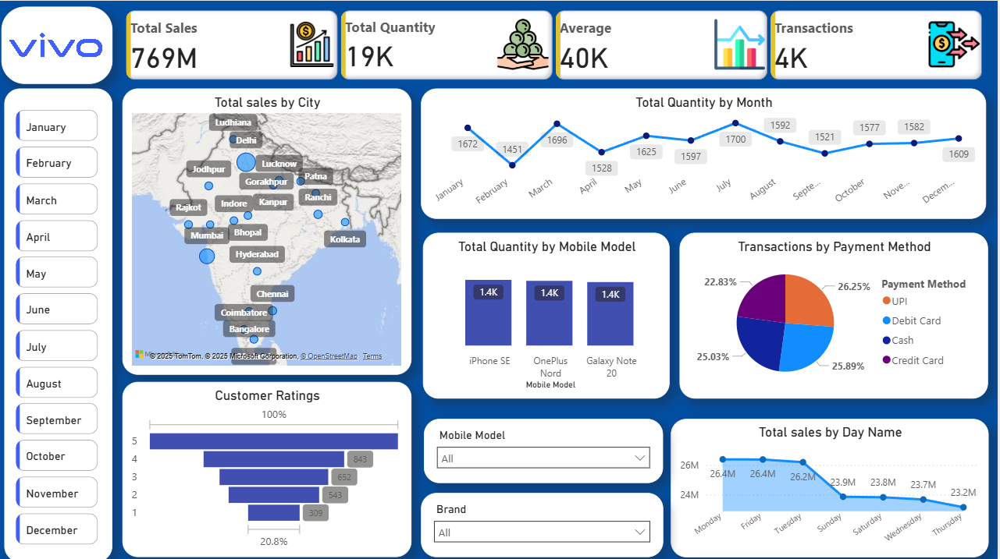

# 📊 Vivo Sales Dashboard - Power BI

## 🔎 Project Overview
This project is an **interactive Sales Dashboard** built using **Power BI** to analyze **Vivo mobile sales data** across multiple dimensions such as **city, mobile models, payment methods, customer ratings, and time trends**.  

The goal of this project is to demonstrate **Business Intelligence (BI) reporting, data modeling, and visualization skills** using Power BI.

---

## 🚀 Key Features
- **Total Sales, Quantity, Transactions, and Averages** displayed in KPIs.
- **Geo Visualization**: Sales performance across Indian cities using a map chart.
- **Time Series Analysis**: Total quantity by month and total sales by day name.
- **Customer Insights**: Customer ratings distribution and satisfaction analysis.
- **Product Analysis**: Quantity breakdown by mobile models and brands.
- **Payment Method Insights**: Transactions split across UPI, Debit Card, Credit Card, and Cash.
- **Interactive Filters**: Slicers for Month, Mobile Model, and Brand for drill-down analysis.
- **Modern Dashboard UI** with clean layout and visuals.

---

## 📂 Dataset
The dataset includes:
- **Sales Data** (Revenue, Quantity, Transactions)  
- **Customer Ratings**  
- **Payment Methods**  
- **Mobile Models and Brands**  
- **City-wise Sales Distribution**  

---

## 🛠️ Tools & Technologies
- **Power BI Desktop**
- **DAX (Data Analysis Expressions)** for calculated measures and columns
- **Data Modeling & Relationships**
- **Power Query** for ETL (Extract, Transform, Load)

---

## 📷 Dashboard Preview

---

## 💡 Insights Derived
- Highest sales observed in **major metro cities like Mumbai, Bangalore, and Hyderabad**.  
- **UPI & Debit Card** are the most preferred payment methods.  
- Sales show fluctuations across **days of the week**, peaking around **Friday**.  
- **Customer satisfaction** trends highlight strong 4★–5★ ratings.  
- Certain models like **iPhone SE, OnePlus Nord, Galaxy Note 20** show high sales volume.

---

## 🎯 Skills Demonstrated
- Data Visualization with Power BI  
- Business Intelligence Reporting  
- KPI Design & Dashboarding  
- Data Cleaning & Transformation (ETL)  
- DAX for Calculations  
- Storytelling with Data  

---

